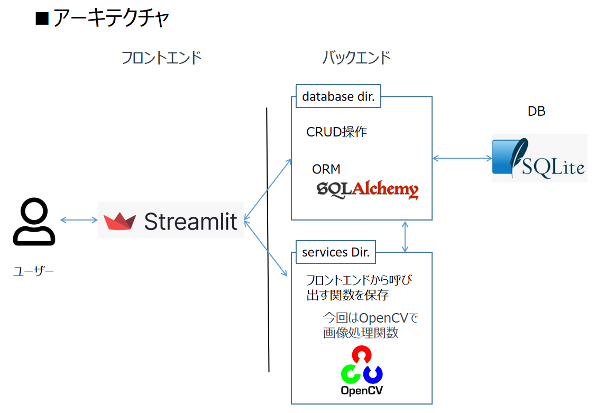

# Python version 3.11.9

## 実行環境
このアプリはubuntu環境でのみ実行します。
(mediapipe0.10.20とstreamlitの組み合わせではエラーが生じる可能性があります。)

## 採用技術

- **フロントエンド**: Streamlit
- **ORM**: SQLAlchemy
- **データベース**: SQLite
- **デザイン**: Material Design Icons
- **画像処理**: OpenCV

## アーキテクチャ



## GIF

How to use this application.


## Directory structure

```bash
streamlit-image-process-manager/
├── src/
│   ├── database/            # データベース設定
│   │   ├── cruds/
│   │   │   ├── image_data.py
│   │   │   └── processed_image_data.py
│   │   ├── database.py
│   │   └── models.py
│   ├── schemas/             # スキーマdirectory
│   │   └── schemas.py
│   ├── services/            # フロントエンドから呼び出す関数を保存
│   │   ├── delete_image_data.py
│   │   ├── dummy_heavy_image_processing.py
│   │   └── initialize_setting.py
│   ├── utils/               # 汎用関数
│   │   ├── encode_image.py
│   │   ├── format_datetime_column.py
│   │   ├── image_utils.py
│   │   └── send_line_message.py
│   ├── pages/
│   │   ├── main_manage.py
│   │   ├── only_streamlit_function.py
│   │   ├── processed_check_page.py
│   │   ├── comment_page.py
│   │   └── README.py
│   ├── router.py            # ルーティング設定
│   └── app.py               # メインアプリケーション
├── .streamlit/              # streamlit標準config
│   └── config.toml
├── data/                    # 画像保存先
│   ├── processed/
│   └── raw/
├── .env                     # 環境設定
├── .python-version          # Python versionの固定
├── uv.lock                  # 依存関係の固定
└── data.db                  # データベース(SQLite)
```

## uvによる仮想環境管理

- 仮想環境作成<br>
  => uv init .<br>

- ライブラリのインポート<br>
  => uv sync<br>

- requirements.txt<br>
  uv add -r requirements.txt<br>
  uv pip freeze > requirements.txt<br>

- upgrade<br>
 uv lock --upgrade<br>
  or<br>
 uv pip install --upgrade "(package)" <br>

- アプリの実行<br>
- uv run streamlit run src/app.py

## <div align="center">streamlit-cloud で公開中 🚀 NEW</div>

https://imaima-image-process-manager.streamlit.app/
